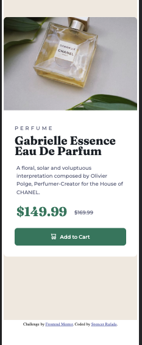

# Frontend Mentor - Product preview card component solution

This is a solution to the [Product preview card component challenge on Frontend Mentor](https://www.frontendmentor.io/challenges/product-preview-card-component-GO7UmttRfa). Frontend Mentor challenges help you improve your coding skills by building realistic projects. 

## Table of contents

- [Overview](#overview)
  - [The challenge](#the-challenge)
  - [Screenshot](#screenshot)
  - [Links](#links)
- [My process](#my-process)
  - [Built with](#built-with)
  - [What I learned](#what-i-learned)
  - [Continued development](#continued-development)
  - [Useful resources](#useful-resources)
- [Author](#author)
- [Acknowledgments](#acknowledgments)

**Note: Delete this note and update the table of contents based on what sections you keep.**

## Overview

### The challenge

Users should be able to:

- View the optimal layout depending on their device's screen size
- See hover and focus states for interactive elements

### Screenshot

### Links

- Solution URL: [GitHub Repository](https://github.com/spencer-rafada/frontendmentor-challenges/tree/master/product-preview-card-component-main)
- Live Site URL: [GitHub Pages](https://spencer-rafada.github.io/frontendmentor-challenges/product-preview-card-component-main/)

## My process

For this challenge, I set a goal to use BEM notation as the naming convention for the classes and use SASS as the pre-processor of the CSS. I started by creating the divisions that I think that are useful. After setting up the HTML, I proceeded with the CSS.

### Built with

- CSS
- HTML
- SASS
- BEM Notation

### What I learned

Although not perfect, I learned BEM notation and strive to name classes with this notation. I also learned how to use a CSS pre-processor, SASS. Throughout this challenge, I learned how important it is to go to details when it comes to CSS. I appreciate the detailed-oriented process and would love to be better at it next time.

### Continued development

I found interactivity useful on this one. To really specify the details on each CSS selectors specially when I go through the media query.

### Useful resources

- [Image Changing for Interactivity](https://stackoverflow.com/questions/27853884/media-queries-and-image-swapping)

## Author

- Website - [Spencer Rafada](https://github.com/spencer-rafada)
- Frontend Mentor - [@spencer-rafada](https://www.frontendmentor.io/profile/spencer-rafada)
- LinkedIn - [N. Spencer Rafada](https://www.linkedin.com/in/spencer-rafada/)

## Acknowledgments

I acknowledge the people that I am surrounded with for continuing to give me feedback on the passion projects that I work on. Salute!
